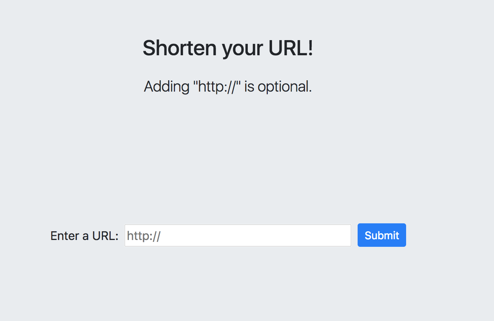
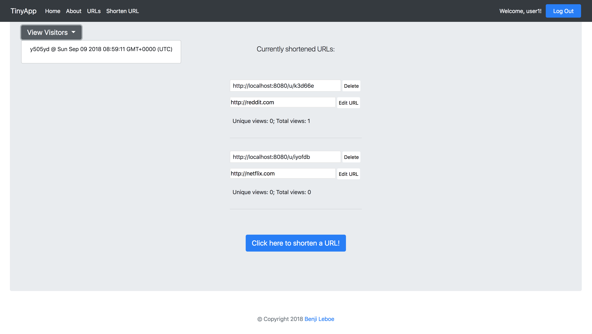

# TinyApp project for Week 2 at LHL

### Overview

TinyApp was is a full-stack web app built by Benji Leboe for the first big project at Lighthouse Labs. The core requirements were built over the course of four days during the second week of the course. Stretch features were implemented Saturday.

It takes long URLs and shortens them, storing them in a database for later access. The shortened links are available for anyone to follow. 

## Features

- Users can register for an account. Passwords are hashed with bcrypt and login information, along with a unique user ID, is stored in a database.

- Shortened URLs are only available to the registered users that created them. Users must be logged in to view their list of short URLs. Shortened links, however, are useable by anyone that they are shared with.

- Users can create, edit, and delete shortened links at will.

- Extremely long links will be truncated but still available to copy/select in their entirety on the URL index page.

- Included analytics features to track unique visits for each link as well as a list of visitors that follow your shortened URL links.

## Dependencies

- Node.js
- Express
- EJS
- bcrypt
- cookie-session
- body-parser
- method-override

##Extras

- Using Bootstrap 4 CSS via CDN link in head
- Using Popper.js via CDN for dropdown list of visitors

## Get Started

- Clone repository to local drive
- Install all dependencies with `npm install`
- Run web server with `node express-server.js`
- Visit localhost:8080 in your browser